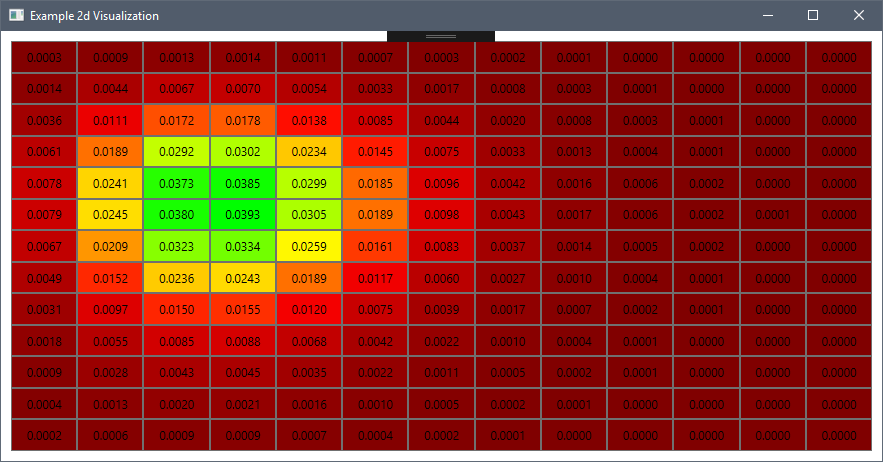

# dotnet-probability-space-calculation



Visualisation using WPF dynamically generated heatmap.

# Overview

Exploratory research project enabling setup of various automated CI/CD components and services.

Problem domain used is the calculation of a Bivariate Poisson 2d probability space.  The focus of this exercise is more to understand options, 
dependencies and complexity of automating C#/.Net build pipelines than the domain itself.

# Stack
* .NetCore 2.2
* C# 7
* Math.net Numerics
* Coverlet (C# coverage testing)
* NUnit

## Components under consideration / evaluation
* Cake
* Travis CI
* Jenkins
* Code Climate
* nUnit / xUnit / MSTest
 
## Running Notes
Example running Cake file created / included in root i.e.
``` powershell
./build.ps1
```
### To execute from the command line
```
dotnet restore
dotnet test ./PredictiveModellingTest/PredictiveModellingTest.csproj 
    /p:CollectCoverage=true /p:CoverletOutputFormat=cobertura 
	/p:CoverletOutput=./PredictiveModellingTest/cobertura.xml
```

### Status / Summary
* Travis CI automated build / badge status update [working].
* Jenkins automated build using Cake build script [working].
* Code Climate integration (code analysis) [working].
* Code Climate coverage reporting [broken - suspected upstream / platform issue].

### Follow-on (Future possibly private dev't) 
* Explore use of Sonar Cloud.
* Explore integration of selenium / appium testing, integrated with Cake / Travis.
* Extend / enhance WPF viewer to enable dynamic update from NATS / RabbitMQ / SQS etc.
* Alternative visualations showing realtime outcome distribution.