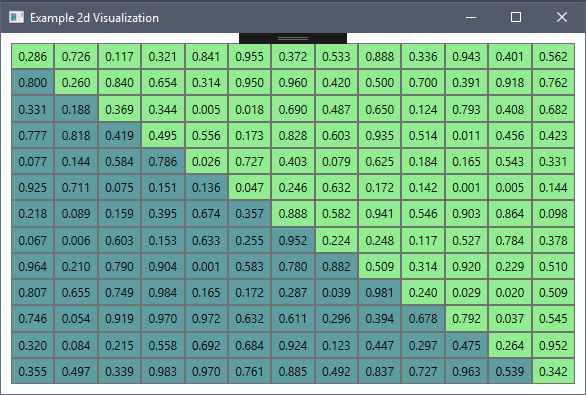

# wpf-dotnet-probability-space-visualisation




Exploratory (scratch) project enabling setup of various automated CI/CD components and services:

# Stack
* .NetCore 2.2
* C# 7

## Components under consideration / evaluation
* Cake
* Travis CI
* Jenkins
* Code Climate
* Sonar Cloud
* Team City

## Running Notes
Example running Cake file created / included in root i.e.
``` powershell
./build.ps1
```
### To execute from the command line
```
dotnet restore
dotnet test ./PredictiveModellingTest/PredictiveModellingTest.csproj /p:CollectCoverage=true /p:CoverletOutputFormat=cobertura /p:CoverletOutput=./PredictiveModellingTest/cobertura.xml
```

### Status
* Travis CI automated build / badge status update [working].
* Jenkins automated build using Cake build script [working].
* Code Climate integration (code analysis) [working].
* Code Climate coverage reporting [broken - suspected upstream / platform issue].
